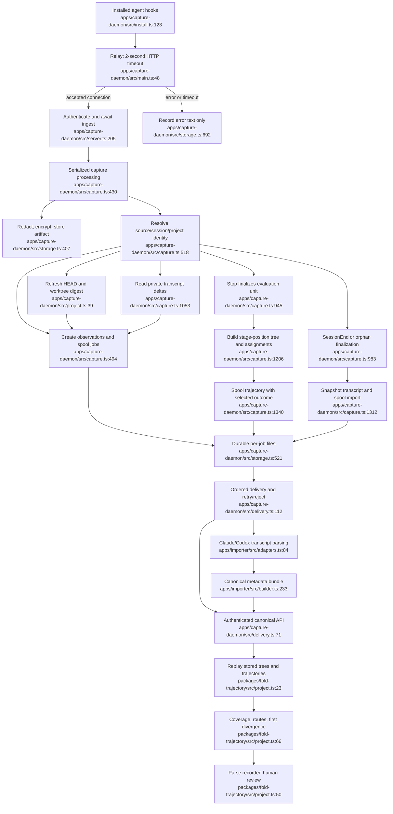

# Evidence acquisition and evaluation

Assessment date: 2026-09-04. Read-only source assessment; no product changes. The parent observed 14,224 hooks, 72 finalized units, zero truncated steps, zero failed spool jobs, and 156 relay failures (latest a timeout). Those counters are supplied operational observations, not independently rechecked here.

## Assessment

This is a substantial working capture system: encrypted/redacted evidence, durable downstream delivery, recovery journals, source-qualified sessions, project and revision metadata, per-turn trajectories, tool timing, reasoning evidence, human-decision events, and replayable comparative analysis are all real code. The highest-value next work is to establish trustworthy labels and complete evidence receipt before adding more sensor sources. The empirical evaluation goal remains unproven: automated trajectories currently describe observed sequences, and their reported mapping coverage does not establish semantic cross-model alignment.

## Current flow

Side effects: local state/vault/step-journal/spool file writes; Git subprocesses; local HTTP receipt; downstream authenticated HTTP; transcript snapshots; canonical writes behind the API. Analysis is derived from canonical records. The command-oracle package exists, but the production trajectory report's `evaluateRecord` currently configures only the human review handler (`packages/fold-trajectory/src/project.ts:50–63`).

## Findings and priorities

### E1 — Close the gap before durable receipt

**Priority: before relying on capture completeness.** `relay()` times out after two seconds and lifecycle-hook failures only append timestamp/source/endpoint/error text (`main.ts:48–80`, `storage.ts:692–707`). There is no sender-side payload outbox or replay identifier. A timeout may mean the daemon received and continues processing the hook; it is not proof of loss. A daemon-down or pre-receipt failure, however, leaves nothing here to replay. Zero failed downstream spool jobs consequently does not demonstrate zero missing source hooks.

All ingest and heartbeat work shares one promise chain (`capture.ts:430–439`). Receipt waits for vault/state writes, Git refresh, trajectory construction, step synchronization and sometimes all available reasoning deltas before returning (`capture.ts:593–616,775–832,1020–1050,1068–1125`). Git calls permit 750 ms each (`project.ts:12–23`), and every post-tool hook refreshes the repository. Queueing can exceed the relay budget without a broken API.

Recommended mechanism: durable encrypted/redacted ingress envelope before slow processing, sender-generated event ID/sequence, distinct occurred/received/processed timestamps, reconciliation of acknowledged IDs, and age/count metrics at each stage. Preserve failed payloads for bounded replay. Validate daemon absence, restart, bursts, slow Git and lost acknowledgments. Keep hooks quick and avoid blocking the coding host.

### E2 — Verification signals are stronger than their evidence supports

**Priority: before automatic learning from successful trajectories.** `verificationKind` searches the entire command text for words such as `test`, `lint` or `build` (`capture.ts:120–126`). `toolSucceeded` defaults missing structured exit/status evidence to `true` (`capture.ts:129–135`). A matching command that merely mentions tests, or a partial/missing result, can become `verification_result.status=success`. This is an accepted inference path in the implementation: `ingest` accepts an unknown payload, validates that it is an object, and does not require structured tool-result evidence (`capture.ts:430–433,593–596,742–745`); whether actual native harness protocols guarantee a stronger result is not established by this audit. Each new check overwrites `lastVerification` (`capture.ts:808–832`), and the final task outcome is `explicitOutcome ?? lastVerification ?? "unknown"` (`capture.ts:1348`). A later successful lint check can therefore overwrite a failed test check and label the task successful.

Good existing behavior: subsequent successful mutating tools or repository changes invalidate previous verification (`capture.ts:775–807`), and unverified normal completion remains unknown (`capture.ts:1348–1360`). The gap is interpreting a tool/check result as task fulfillment, not absence of an outcome field.

Recommended mechanism: immutable typed check evidence with exact command or artifact reference, numeric exit code, task/revision scope, check category, expected acceptance criterion, parser version and explicit unknown. Compute task outcome from required checks or an independently attributable verdict. Keep check success, execution completion and product/task acceptance distinct. Preserve negative evidence after later unrelated successes.

Historical import has a related concrete defect: every Codex `function_call_output`/`custom_tool_call_output` invokes `addToolResult(..., false, ...)` (`apps/importer/src/adapters.ts:169–171`), and that boolean creates `status:"completed"` (`builder.ts:214–229`). The original output remains in the private artifact, but canonical action status does not preserve failure/unknown.

### E3 — Cross-model alignment needs an independent test

**Priority: core product proof.** The automatic shared-node ID combines step position with a hash of kind, role, tool name and exact content (`capture.ts:317–325`). Generic recorded steps are `Invoke <tool>` and `<tool> completed/failed` (`capture.ts:705–713,764–773`). Different commands executed through the same tool at the same position can merge into one apparent decision. Equivalent actions after an inserted observation get different IDs. Exact reasoning-summary wording likewise produces separate nodes.

The daemon builds each run's tree from those same steps and assigns every step as mapped with confidence 1 (`capture.ts:1206–1247,1365–1369`). The coverage is structurally correct for this self-created tree; it cannot validate the semantic projection bet identified in the reference. `fold-trace` already supports explicit ambiguous and unmapped assignments (`packages/fold-trace/src/types.ts:79–95`), so the representation can accommodate honest uncertainty.

Recommended experiment: one fixed task and starting repository state, two materially different models, a small independently defined decision tree, blind/manual reference assignments, preserved ambiguous/unmapped steps, repeated runs, and acceptance checks. Report mapping agreement, ambiguity, outcome quality, elapsed time/cost and intervention counts. The current test proves repeated-prompt grouping and divergent tool names, not semantic equivalence (`capture.test.ts:294–313`).

### E4 — A task comparison requires a versioned experiment manifest

**Priority: capture now; needed for useful evaluation.** Task grouping defaults to a normalized prompt hash plus project ID, or an explicitly supplied task/comparison key (`capture.ts:631–659,309–315`). The same prompt after different conversation history, repository changes or dependency updates groups together. Different phrasing of the same task groups apart. No acceptance-spec version, immutable start-state snapshot, input context manifest or experimental condition appears in the trajectory input (`capture.ts:1372–1382`).

Model is optional in live hooks and falls back to the harness name (`capture.ts:542–560,1375–1377`). Historic `TranscriptBuilder.setModel` replaces a single run-level value as records arrive; only the last observed model is emitted (`builder.ts:119–120,267`). Per-turn model/version, reasoning configuration, input/output/cached/reasoning tokens, cost, context-budget pressure and compaction lineage are absent from the strict canonical transcript schema (`packages/fold-transcript/src/schema.ts:34–88`). Generic hook events retain names and selected metadata, but do not make those dimensions queryable (`capture.ts:1001–1017`).

Recommended fields: task ID + task version; attempt/run/parent run and turn IDs; exact model/provider/version per turn or span; effective inference settings; tool/MCP and instruction/config digests; starting commit and dirty-patch artifact; environment/dependency fingerprint; usage/cost and run timings; context compactions; memory/context used; explicit intervention and final acceptance events. Store sensitive text in the vault and canonical references/digests in Fold. Unknown should remain explicit rather than a harness name masquerading as a model.

### E5 — Revision fingerprints are valuable but not replayable artifacts

**Priority: capture now when inexpensive.** HEAD, branch, dirty paths and worktree digests are already captured. `refreshProject` computes Git status and tracked binary diff, then stores only a digest (`project.ts:39–55`). The patch bytes are discarded; untracked file contents are not included in `git diff HEAD`, so rewriting an existing untracked file may leave the digest unchanged. Git errors are silently returned as undefined, which can make the new digest appear to represent an empty diff (`project.ts:12–23,54`).

Capture content-addressed patch/output artifact references and before/after hashes for changed files where consent permits, including untracked content; retain an explicit fingerprint error/incomplete flag. This makes failure reproduction, regression attribution and fair comparisons possible. It also prevents treating unrelated shared-worktree mutations as certainly caused by the immediately preceding tool. Current code refreshes after each tool but has no author-of-mutation attribution (`capture.ts:775–807`).

### E6 — Human intervention has a useful event path but weak actor attestation

**Priority: before treating human evidence as privileged learning input.** `/decision` and `/checkpoint` are authenticated with the same hook credential and translated into payload hook names (`server.ts:205–221`). `HumanDecision` supplies summary/verdict/confidence but no separately authenticated human actor (`capture.ts:887–918`). An agent using the checkpoint MCP tool can choose the human-decision kind (`apps/mcp-server/src/main.ts:90–116`). This distinction is a claim by the caller, not independently demonstrated human origin.

Use an operator-authenticated decision route or preserve “agent-reported human decision” as a separate provenance class. Capture intervention reasons, exact affected task/turn/revision, accept/reject/edit/retry/revert, and links to subsequent validation. Existing permission requests and generic subagent/model-switch events can supply useful raw evidence, but resolving an operator intervention and linking it causally needs more structure.

### E7 — Lifecycle timeout should remain an explicit policy judgment

**Priority: before autonomous fleet actions.** Restored sessions correctly load inactive (`storage.ts:159–169`), and normal freshness is distinguished from last-known status. However, the daemon continues emitting heartbeats for locally active sessions until the orphan threshold (`capture.ts:1399–1423`), and `finalizeOrphan` emits a canonical `offline` solely after time without a hook (`capture.ts:1426–1450`). Fleet consumes offline as stopped (`packages/fold-fleet/src/project.ts:176–187`). This differs from the reference invariant that silence alone does not establish offline (`Fold_Platform_Super_Brain_Unified_Reference_v8.md:36–40`).

Keep capture-service liveness distinct from harness-process/session liveness; represent timeout finalization as recovery policy with unknown process status, or verify a process/session lease before asserting offline. Do not auto-act from apparent online/offline until this distinction is reliable.

### E8 — Shareable evaluation export is distinct from the private backup

**Priority: before the sponsor/demo dataset is shipped.** The execution backlog explicitly requires a reproducible evaluation dataset (`docs/EXECUTION_BACKLOG.md:58–67`). The current `exportCaptureData` copies the whole local capture state and private vault, optionally includes the vault key, and writes authorized canonical/draft events plus file hashes (`apps/capture-daemon/src/maintenance.ts:81–124`). That is useful private backup/export behavior. Its manifest describes file integrity and workspace context (`maintenance.ts:16–25`), not selected experiments, task versions, annotation policy or permitted distribution. A hash manifest demonstrates integrity, not experimental reproducibility or consent to share source evidence.

Add a distinct evaluation exporter that selects an explicit task/run set, includes the immutable experiment manifest and oracle/annotation versions, resolves selected evidence references, and checks allowed audience/export consent. Produce a reviewable redacted share bundle with no operator credentials or private vault keys, a data dictionary, exclusion reasons, license/permission metadata and a deterministic report regeneration command. Keep the existing backup flow private; do not repurpose it as the sponsor dataset.

## Duplication worth a later consolidation pass

Live capture and historical step recovery repeat `verificationKind`, `toolSucceeded`, tool names, input aliases and tool pairing (`capture.ts:71–135,171–173`; `recovery.ts:17–57`). Both share missing-result success defaults. They already diverge: live invalidation considers Git changes and explicit FileChanged observations (`capture.ts:775–845`), while recovered `unitOutcome` only resets for edit/write/patch/notebook step names (`capture.ts:297–305`). A successful test followed by a shell-based mutation can be assessed differently during backfill. One pure normalized-hook-to-evidence function, called by live processing and recovery, would protect parity; keep side effects and retrospective policy separate.

## Existing strengths to preserve

- Raw bodies and opaque reasoning stay in private redacted/encrypted artifacts; canonical events carry references and allowed summaries (`storage.ts:407–430`, `capture.ts:1053–1126`).
- Capture identity includes source/session/project/branch, model when supplied, harness version, turn, HEAD and worktree digest (`capture.ts:449–479`).
- Ordinary unverified completion is unknown, mutation invalidates previous checks, and explicit failed response can record failure (`capture.ts:775–845,945–981,1348–1360`).
- Finalized prompt-to-response units make long CLI sessions useful without requiring session shutdown (`capture.ts:631–677,945–981`).
- Shared-tree revisions are additive, projection gaps are representable, and route analysis counts unknown outcomes separately (`fold-trajectory/src/project.ts:23–47`; `fold-trace/src/types.ts:79–95`; `fold-trace/src/analysis.ts:87–173`).
- Stored-hook evidence, append-only step journals, controlled backfill and private transcript snapshots provide real repair mechanisms for evidence that reached the daemon (`capture.ts:345–390,1129–1203,1312–1337`).

## External dependencies

- Canonical platform: `@_89/super-brain-client` and authenticated API own event append, trajectory/tree writes and transcript import delivery (`apps/capture-daemon/src/delivery.ts:71–109`).
- Memory feature: successful trajectories and observed checkpoints are consumed by the worker; inaccurate outcome/actor labels therefore affect promotion (`apps/memory-worker/src/worker.ts:196–255`).
- Operator/agent feature: the UI inspects catalog/trajectory/fleet projections, and MCP exposes explicit checkpoints/decision claims (`apps/mcp-server/src/main.ts:90–116`).
- Local external inputs: native Claude/Codex JSONL, Hermes gateway hooks, Git checkout/process, filesystem encryption keys, and harness hook configuration.

## Sources and confidence

Exact source ranges read (repository-relative paths):

- `apps/capture-daemon/src/main.ts:1–135`
- `apps/capture-daemon/src/types.ts:1–166`
- `apps/capture-daemon/src/capture.ts:1–38,95–218,290–394,430–1457`
- `apps/capture-daemon/src/server.ts:150–225`
- `apps/capture-daemon/src/delivery.ts:65–139`
- `apps/capture-daemon/src/project.ts:1–80`
- `apps/capture-daemon/src/storage.ts:1–235,397–472,484–592,692–727`
- `apps/capture-daemon/src/recovery.ts:1–160`
- `apps/capture-daemon/src/reasoning.ts:1–120`
- `apps/capture-daemon/src/install.ts:1–214`
- `apps/capture-daemon/src/maintenance.ts:1–163`
- `apps/capture-daemon/test/capture.test.ts:1–80,125–234,280–345`
- `apps/importer/src/adapters.ts:84–184`
- `apps/importer/src/builder.ts:90–300`
- `packages/fold-transcript/src/schema.ts:1–137`
- `packages/fold-trace/src/types.ts:1–170`
- `packages/fold-trace/src/analysis.ts:66–173`
- `packages/fold-trajectory/src/project.ts:1–98`
- `packages/fold-eval/src/oracle.ts:1–200`
- `packages/fold-fleet/src/project.ts:1–236`
- `apps/mcp-server/src/main.ts:1–130`
- `apps/memory-worker/src/worker.ts:196–255`
- `README.md:1–156`, `docs/ARCHITECTURE.md:1–233`, `docs/ROADMAP.md:1–63`
- `docs/EXECUTION_BACKLOG.md:1–180`
- `Fold_Platform_Super_Brain_Unified_Reference_v8.md:21–112`

Confidence is high for the code-level conditions above and medium for their frequency or user impact. No live destructive experiments, remote deployment audit or new implementation was performed. Hook-counter observations do not measure unrecoverable loss without receipt correlation. Native provider schemas and event availability were not independently verified against current vendor documentation; absent canonical fields are established from this repository, while provider availability needs a compatibility pass. The analysis does not claim private evidence is absent merely because its canonical projection is thin.
