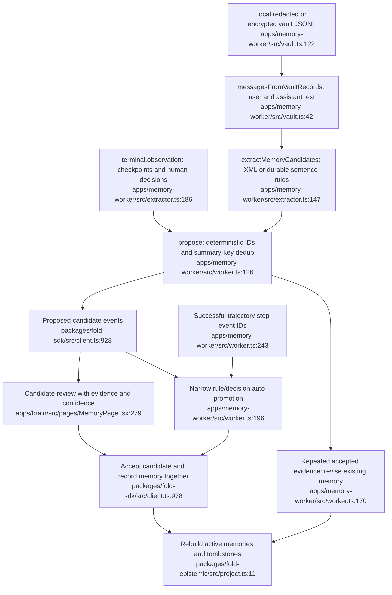
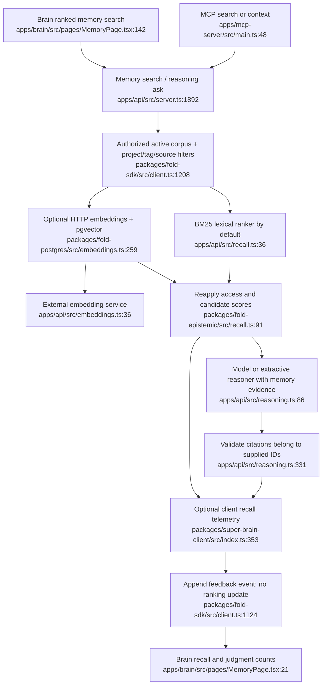
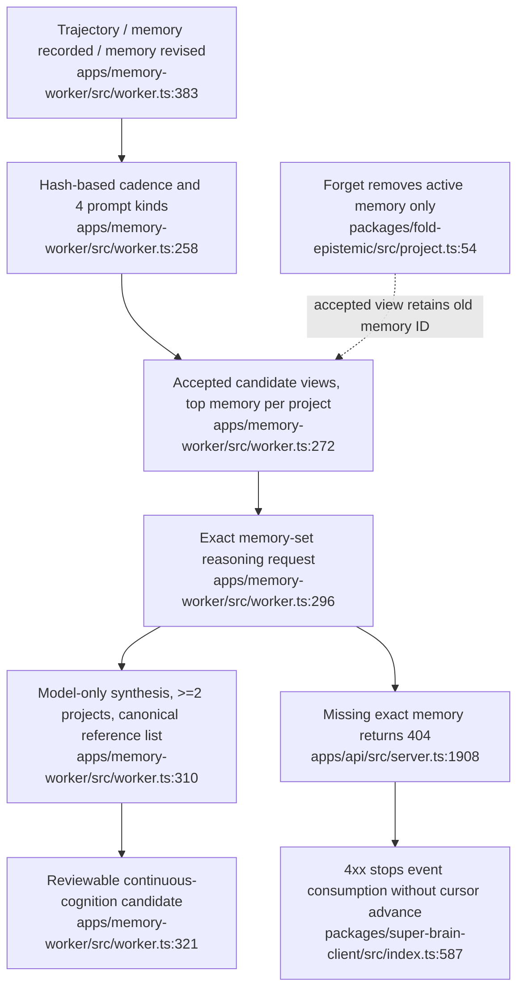
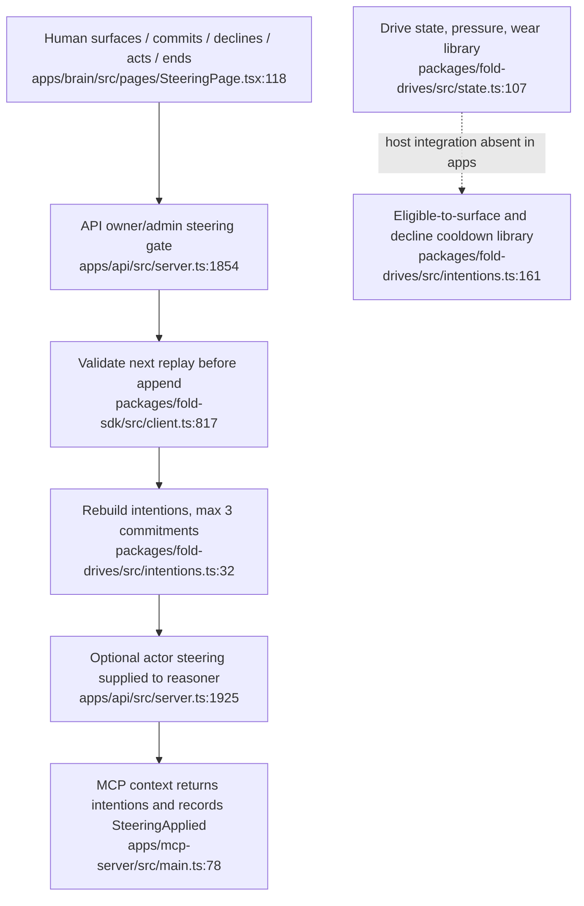

# Memory, learning, recall, and steering: implementation audit

Audit date: 2026-09-04 (local Vancouver date). Scope: `apps/memory-worker`, `packages/fold-epistemic`, `packages/fold-drives`, API recall/reasoning, MCP consumption, and Brain memory/steering surfaces. This is a read-only implementation audit; only this report was added. All source ranges below are inclusive and repository-relative. No production content was opened by this agent.

## Assessment

The local vertical slice is real: there is vault-backed extraction, proposal review, atomic acceptance batches through PostgreSQL, authorized recall, model reasoning, cross-project proposals, and human steering. This is considerably beyond a transcript archive. The main unfinished piece is **reliable learning from use**: extraction coverage is narrow; usefulness judgments are stored but do not change retrieval; correction has no dependency propagation; automated synthesis operates on a very small and stale subset of accepted proposals. Batch insertion does not yet make concurrent domain validation atomic; see the platform report.

The highest-value shipping work is to make one loop reliable and observable: capture a real decision and its verification, create a scoped memory, retrieve it on a later task, link its actual use to the outcome, and correct or retire it when circumstances change. Adding another source connector or a larger autonomous cognition loop is lower value than completing that loop.

Parent-agent metadata-only census, 2026-09-05 01:25–01:26 UTC: 38,683 events, 81 projects, 770 runs, 1,967 active memories, 2,577 candidates including 610 pending, and **zero `memory.feedback-recorded` events**. Queried intention surfaced/committed/acted/ended counts were also zero. These are the correct intention kind names (`packages/fold-drives/src/events.ts:20-25`). This demonstrates meaningful capture volume; it does not yet demonstrate that the accumulated memories improve subsequent work.

## Current data flow

### Extraction and provenance

- `readVaultMessages` resolves a content-addressed local artifact, prefers encrypted JSONL when present, decrypts each line, and converts parsed records to message text. It returns `undefined` when the artifact cannot be found; malformed JSON lines are silently skipped (`apps/memory-worker/src/vault.ts:116-145`). The worker needs the vault on the machine where it runs: canonical API transcript metadata cannot reconstruct text absent from that vault.
- `messagesFromVaultRecords` accepts Claude Code and Codex user/assistant text, rejects obvious boilerplate, removes tool-result turns from the Claude user-message path, and uses source/native-run/ordinal turn IDs (`apps/memory-worker/src/vault.ts:42-113`). Tool outputs, diffs, screenshots, and verification results are not themselves analyzed by this archive memory extractor, even where other project subsystems capture them.
- `structuredObservations` parses `<observation>` XML in any message, extracting title, subtitle, narrative, facts, concepts, and files. It attaches an import-event/run/turn reference and fixed confidence 0.96/salience 0.9 (`apps/memory-worker/src/extractor.ts:66-111`). This preserves a location to investigate, rather than proving the statement true. There is no actor-role or authenticated observer check inside this extractor.
- `durableStatements` uses hand-written English regexes, sentence lengths 40–500, question/in-progress exclusions, role-specific confidence defaults, and architecture/security/deploy salience keywords (`apps/memory-worker/src/extractor.ts:115-145`). A message containing XML observations bypasses durable-sentence extraction. The scan returns the **first 25 unique candidate summaries by default**, not the 25 most valuable, and stops reading candidates after the cap (`apps/memory-worker/src/extractor.ts:147-169`; CLI default at `apps/memory-worker/src/main.ts:49-50`). A long session can lose its final resolution while preserving early decisions later overturned.
- Live extraction intentionally accepts only `reasoning_checkpoint` and `human_decision`, preserving hypothesis, supporting evidence, decision, verdict, artifact, session, turn, model, and runtime when supplied (`apps/memory-worker/src/extractor.ts:186-235`). It creates a candidate from the reported summary; it does not independently inspect the cited artifact or verification.
- Project inference uses transcript segments and file-path matches against known roots; roots are configured at worker startup or an archive scan (`apps/memory-worker/src/worker.ts:70-104,345-369`). An unresolved memory has `projectIds: []`, and recall treats that as applicable to all requested projects (`packages/fold-epistemic/src/recall.ts:49-53`). Unknown project attribution is currently indistinguishable from deliberately global applicability.
- Candidate metadata carries proposer, source, extractor/version, confidence, salience, evidence, and timestamps (`packages/fold-epistemic/src/types.ts:116-154`). Accepted memory preserves source/content/entities/evidence, but **not confidence, salience, or extractor as direct fields** (`packages/fold-sdk/src/client.ts:991-1003`; active shape in `packages/fold-epistemic/src/types.ts:23-39`). The acceptance event's `causedBy` links back to proposal and decision, so historical lineage exists if a consumer traverses the log.
- Evidence IDs are shape-validated, not resolved for existence/visibility at proposal creation: SDK proposal paths pass directly to event builders and append; evidence checks require strings and a nonempty evidence array (`packages/fold-sdk/src/client.ts:907-958`; `packages/fold-epistemic/src/candidates.ts:219-237`). Thus the MCP description “backed by existing canonical event IDs” is a caller contract, not an enforced evidence-integrity guarantee (`apps/mcp-server/src/main.ts:119-142`). A citation ID should not be displayed as verified evidence without resolution.

### Deduplication and acceptance

`candidateKey` consists of source, whitespace-normalized lowercased summary, and sorted project IDs (`apps/memory-worker/src/worker.ts:107-112`). It does not include audience, space, content, extractor version, or originating principal. `initialize` fills caches from accessible candidates, preferring an accepted view when multiple keys collide (`apps/memory-worker/src/worker.ts:46-68`). This avoids straightforward duplicates, but it is neither semantic consolidation nor scope-aware truth maintenance.

`propose` skips known IDs; merges evidence into an existing **accepted** memory; ignores repeated pending/rejected candidates; and drops same-key duplicates inside a new batch (`apps/memory-worker/src/worker.ts:126-192`). New proposals populate known ID/key sets without updating `candidatesByKey`, so later occurrences in the same process can be discarded until a candidate refresh. The worker does not subscribe to candidate acceptance/rejection events (`apps/memory-worker/src/worker.ts:369-385`). A human review can therefore leave the worker's per-key view stale. Repeated observations should remain independent evidence even before acceptance, with explicit contradiction/duplicate judgments rather than unconditional title equality.

Auto-promotion is opt-in in direct CLI use. It accepts project-scoped XML observations at fixed confidence ≥0.95 or all project-scoped `live-human-decision` candidates (`apps/memory-worker/src/worker.ts:195-232`). The service installer defaults auto-promotion on unless `--no-auto-promote` is supplied (`apps/memory-worker/src/main.ts:27-31`). A human-decision candidate can have a failure verdict or low confidence and still satisfy this policy; its durable meaning may be valid, but the current gate is source-based, not an evidence-calibrated truth threshold. Reasoning checkpoints become eligible when their evidence event appears in a trajectory labelled success (`apps/memory-worker/src/worker.ts:243-255`); the worker does not examine a verification oracle itself.

The API requires owner/admin for workspace candidate acceptance/rejection and batches are bounded at 100 (`apps/api/src/server.ts:2086-2145`). The SDK constructs both decision and memory events, rebuild-validates them, and appends as one sequence (`packages/fold-sdk/src/client.ts:1016-1078`). Atomicity uses the backing store's `appendMany`; a custom store without that port falls back to sequential appends (`packages/fold-sdk/src/client.ts:348-376`). The standard production store should remain the authority for this guarantee.

## Recall, reasoning, and feedback

- `rankMemories` builds the full already-authorized active corpus, minimizes it to ranking fields, calls the provider, and filters returned IDs through the same access/scope rules (`packages/fold-sdk/src/client.ts:1208-1257`). Personal memories require creator match; workspace memories are shared; optional spaces still require membership (`packages/fold-epistemic/src/access.ts:36-53`). Project IDs are relevance filters, **not an additional authorization boundary**.
- Default BM25 scores summary/tags/entities/content; scores normalize relative to the top result (`apps/api/src/recall.ts:18-27,39-85`). A displayed “100%” means top relative lexical score, not confidence the answer is correct. Optional pgvector embeddings are real, content-digest/revision-aware, tenant-isolated, and restricted to authorized IDs (`packages/fold-postgres/src/embeddings.ts:206-282`). There is no hybrid ranker, reranker, query expansion, feedback feature, or task-outcome feature in these ranking paths.
- Embeddings are refreshed synchronously during recall over all stale/missing documents, with batches of 64 (`packages/fold-postgres/src/embeddings.ts:206-265`). The HTTP embedding fetch has no timeout (`apps/api/src/embeddings.ts:36-49`). Since SDK ranking runs inside the same serialized enqueue used by memory writes, a stalled sidecar can block subsequent SDK work for that tenant. Move indexing out of the request path, bound provider calls, and expose freshness/lag before scaling the corpus.
- Reasoning can use ranked memories or an exact set of at most ten authorization-checked IDs; a missing exact ID fails the whole request (`apps/api/src/server.ts:1892-1946`). Native providers have deadlines, with explicitly labelled local extractive fallback (`apps/api/src/reasoning.ts:49-72,124-207`). Answers remain noncanonical unless another explicit workflow proposes them. Citation validation enforces ID membership, not semantic entailment of each claim (`apps/api/src/reasoning.ts:331-344`). Neither source revision nor supporting spans are in the returned reasoning citation contract.
- MCP always opts into recall telemetry. Search records every returned memory; reasoning records only cited memories, attaching optional session/task IDs (`apps/mcp-server/src/main.ts:18-27`; `packages/super-brain-client/src/index.ts:326-367`). Every telemetry write is awaited. A read-only credential can successfully retrieve memories and then fail the tool because feedback requires `memories:write` (`apps/api/src/server.ts:1239-1241`). Telemetry also adds one sequential HTTP mutation per result. Give it a narrow permission/batch endpoint and isolate failure from successful recall.
- Feedback captures recalled/helpful/unhelpful/superseded plus optional query/task/session/detail and actor/time (`packages/fold-epistemic/src/feedback.ts:9-25,65-113`). It lacks recall-request ID, memory revision, rank/provider, evidence set, actual injection/use acknowledgement, or outcome attribution. Brain helpful/unhelpful writes only the signal, omitting the query/task context (`apps/brain/src/api.ts:536-543`). A `superseded` judgment is **only feedback**; projection and recall remain unaffected (`packages/fold-epistemic/src/project.ts:11-61`; `packages/fold-epistemic/src/recall.ts:91-124`).
- Brain labels any helpful, unhelpful, or superseded judgment “validated,” including a memory with only negative feedback (`apps/brain/src/pages/MemoryPage.tsx:111-115,195,206-218`). This is judgment coverage, not validation. Use accurate language and separate “supported,” “disputed,” “stale,” and “used successfully.” The live zero-feedback count means even this basic coverage is currently absent.

## Continuous cognition and correction

Cross-project synthesis is an implemented, reviewable model workflow. It is enabled by default for watch mode, selects roughly one in 25 eligible events by deterministic hash, and chooses synthesis/contradiction/procedure/investigation prompts (`apps/memory-worker/src/main.ts:56-75`; `apps/memory-worker/src/worker.ts:24-29,258-271`). It sorts accepted proposals by static salience/confidence/age, takes the first memory per project, samples up to ten projects, and asks the configured reasoner (`apps/memory-worker/src/worker.ts:272-309`). A genuine model answer must cite surviving memories from at least two projects, with at most 20 underlying evidence references; the result is proposed at confidence 0.65 and remains reviewable (`apps/memory-worker/src/worker.ts:310-342`). These are useful guardrails and should be preserved.

Current limitations:

1. The selection pool is accepted candidate views, not all current active memory. Directly authored memories are excluded; revised candidate metadata stays stale; global memories have no project slot; the same highest-salience fact tends to represent a project repeatedly. Hashing varies projects, not the chosen fact within each project.
2. Forgotten memories still have permanently accepted candidate views. A selected forgotten ID makes exact-set reasoning return 404; cognition only special-cases a missing reasoning permission. That error propagates into the stream consumer, which treats it as fatal (`apps/memory-worker/src/worker.ts:272-309`; `apps/api/src/server.ts:1908-1910`; `packages/super-brain-client/src/index.ts:587-599`). Correction must not halt new learning.
3. The candidate content stores citation IDs, provider ID, and trigger event but no cited revision/digest, model-run request ID, token/cost accounting, or stable evidence-set job key. Candidate ID includes the model's full answer (`apps/memory-worker/src/worker.ts:322-340`); after replay a nondeterministic answer can create another candidate for the same evidence. The hash cadence is deterministic; the whole cognition job is not idempotent.
4. There is no typed supersession/contradiction relation, applicability/valid-time model, verification expiration, or derivative invalidation propagation. `MemoryRevisionPatch` permits only summary/content/tags/evidence, so project scope, audience, and entities cannot be corrected in place (`packages/fold-epistemic/src/types.ts:54-59`). Accepted synthesis can outlive the facts it cites.
5. Synthesis, contradictions, procedures, and investigations are stored as different content kinds but share one proposal mechanism. Investigations do not automatically create a bounded steering candidate or task. No learned procedure is validated against a later run before being treated as reusable guidance.

## Durable work, scopes, and team behavior

`consumeEvents` loads a principal-scoped durable cursor, invokes the handler, then commits the cursor; reconnect uses that cursor (`packages/super-brain-client/src/index.ts:571-599`). This is correct at-least-once structure. It retries ordinary errors and server errors after a fixed delay, respects 429 retry hints, and stops on other HTTP 4xx. A failing cognition call shares the handler with extraction/promotion; there are no independent job states, retry counts, dead-letter queue, or worker backlog/lag API in this path.

Two concrete mismatches need shipping attention:

- **Missing artifact is acknowledged as completed extraction.** `extractRun` returns an empty skipped result on unavailable vault (`apps/memory-worker/src/worker.ts:115-123`), `watch` discards that result (`apps/memory-worker/src/worker.ts:374-377`), and the consumer advances its cursor (`packages/super-brain-client/src/index.ts:583-585`). A separate reconciliation scan is needed to find and retry missed runs when the local artifact later appears. Watch currently does not even report this skipped reason.
- **Shared-memory ownership can break the worker.** The accepting principal becomes memory creator (`packages/fold-sdk/src/client.ts:991-1003`; `packages/fold-epistemic/src/events.ts:277`), while revision/forgetting requires the original creator even for another workspace owner/admin (`packages/fold-epistemic/src/access.ts:56-74`; replay enforcement at `packages/fold-epistemic/src/project.ts:36-42`). The API also requires owner/admin for shared revisions (`apps/api/src/server.ts:2243-2248`). When a human accepts a workspace proposal, the worker's same-summary consolidation later tries to revise that human-owned memory (`apps/memory-worker/src/worker.ts:170-192`) and fails. `EpistemicAccessError` becomes HTTP 400 (`apps/api/src/server.ts:690-707`), causing the consumer to exit on the unacknowledged event. Conversely, an owner cannot correct a machine-owned memory through the normal UI. Define collaborative authorship separately from authority to revise shared knowledge, or append evidence/support records without impersonating the creator.

The worker's dedup key also omits audience/space while its initial cache can see both personal and workspace candidates. That permits suppression across those boundaries and potentially mixes evidence into the wrong existing memory (`apps/memory-worker/src/worker.ts:46-68,107-112,126-192`). Scope belongs in any dedup/consolidation identity.

The Brain memory detail offers revise and forget for every visible memory (`apps/brain/src/pages/MemoryPage.tsx:230-237`). It does not explain the creator-only restriction. Evidence appears as raw event/run/turn IDs rather than a navigable, permission-aware evidence view (`apps/brain/src/pages/MemoryPage.tsx:255-256`). A one-click inspection of the originating decision and verification would materially improve review quality and adoption.

## Steering boundary

The intention lifecycle, commitment cap, decline history, and actor-aware pull context are real (`packages/fold-drives/src/intentions.ts:32-113`; `packages/fold-sdk/src/client.ts:775-813`). Drive simulation, pressure ordering, and decline-cooldown eligibility are reusable library mechanisms (`packages/fold-drives/src/state.ts:107-299`; `packages/fold-drives/src/intentions.ts:115-209`). Source search found no app callers for create/advance/integrate drive state. API snapshots sort intentions by formation time, not drive urgency (`packages/fold-sdk/src/client.ts:783-788`). Current shipping behavior is human steering plus optional context delivery, not an operational autonomous drive scheduler.

MCP records `SteeringApplied` whenever a context response contains intentions (`apps/mcp-server/src/main.ts:85-86`; bridge at `apps/mcp-server/src/capture.ts:42-45`). Delivery is not proof of application. Distinguish offered, read, explicitly adopted, acted, and outcome-verified states before using steering compliance to claim benefit.

## Highest-value additions, in order

| Priority | Concrete addition | Benefit and evidence |
| --- | --- | --- |
| Ship | Durable extraction/synthesis jobs with separate retry/skip/dead-letter state; artifact reconciliation and backlog age | Prevents silently missed vault imports and one bad/forgotten memory blocking the whole worker. Keep current event cursor as transport progress, not the only business-completion record. |
| Ship | Shared revision/evidence policy and scope-aware consolidation | Human review, machine consolidation, and operator correction must work together. Resolve creator authority mismatch and stale candidate cache before multi-user deployment. |
| Ship | Recall telemetry failure isolation, narrow feedback permission, and one end-to-end adoption flow | Makes read-only harness use work; allows proving later work actually used memory. Start with recall ID, task/session, memory revision, rank/provider, injection/used status, and linked outcome. |
| Ship | Explicit correction/supersession lifecycle plus source-revision dependencies | Stops stale or contradicted guidance from continuing to rank or generating more synthetic memory; active memory filtering also fixes the forgotten-memory cognition failure. |
| Next | Extraction coverage beyond first-25 rules: task closeout, user corrections, rejected alternatives, verified fixes and failure causes | Captures the highest-value material near final resolution. Prefer structured facts tied to verification and scope over unconstrained larger summaries. Retain complete source offsets and extraction-version coverage. |
| Next | Retrieval evaluation set from real tasks and outcome-linked feedback | Measure recall precision/usefulness, missed relevant memories, time-to-resolution, repeated mistakes, and token/cost savings. Negative feedback needs a review/ranking effect; today's zero feedback is the adoption baseline. |
| Next | Hybrid retrieval, token-budgeted context assembly, and applicability metadata | Useful memories need the current project/task/file/version context, confidence/freshness, diverse evidence, and bounded context size. Do this after a relevance benchmark exists. |
| Next | Evidence-aware synthesis scheduler with novelty and budget gates | Choose topical, current, diverse independent evidence, store deterministic evidence-set jobs and model/cost metadata, and cap proposal volume. Avoid repeatedly summarizing one high-salience fact per project. |
| Later | Procedures and investigations that become bounded, reviewable steering suggestions | Connect existing cognition kinds to actual action and verification. Existing drive libraries and intention events supply much of the foundation; deploying an autonomous scheduler is not necessary for the first useful release. |

## Claims to calibrate

- README's “complete local vertical slice” is reasonable as feature-path existence (`README.md:6-10`). It is not evidence of extraction completeness, useful retrieval, or reliable unattended learning.
- “Consolidates repeated evidence” is true for accepted memories owned by the worker; it is incomplete for pending candidates, same-process freshly proposed candidates, human-accepted shared memories, and cross-scope duplicates (`README.md:99-107`; source paths above).
- “Verified successful trajectory” requires verification at the producer/trajectory boundary. This worker checks only `outcome === "success"`; do not imply independent memory-worker verification (`README.md:102-104`; `apps/memory-worker/src/worker.ts:243-255`).
- “Semantic recall” exists only when real embedding/pgvector configuration is enabled. Default BM25 and extractive fallback are already honestly labelled in code and UI; preserve that distinction.
- “Validated memories,” “SteeringApplied,” and “continuous cognition” should distinguish judgments, context delivery, and sampled proposal generation from measured correctness, application, and continuous improvement.

## External dependencies and evidence confidence

External runtime boundaries are the authenticated Super Brain API/SSE transport; local vault and optional encryption key; PostgreSQL/pgvector when enabled; optional HTTP embedding service; configured Gemini/Claude/Codex or custom reasoning endpoint; local capture daemon for MCP checkpoints/steering; MCP SDK stdio transport; React/Clerk for hosted UI. Native model deadlines exist; embedding and general client HTTP calls lack explicit deadlines in their shown adapters.

Confidence is high for the traced source behavior and gaps where both producer/consumer paths are visible. Team ownership and forgotten-memory failures are control-flow findings, not claims that production has already encountered those failures. The live census was supplied by the parent agent and is metadata-only. Source/trajectory verification policy outside this scope should be checked by the capture/trajectory audit before treating labelled success as unverified in every deployment. No claim is made that a production embedding or reasoning service is currently configured.

Verification performed: existing `@_89/super-brain-memory-worker` suite passes **11 tests across 3 files**. Tests cover XML/live extraction, encrypted artifacts, accepted-memory evidence revision, cross-project model proposals, extractive fallback, and missing reasoning permission (`apps/memory-worker/test/extractor.test.ts:23-141`; `apps/memory-worker/test/worker.test.ts:56-218`). There is no test in that suite exercising shared human-owned consolidation, forgotten-source cognition, pending dedup evidence retention, missing-artifact recovery, or read-only MCP telemetry failure. No implementation or test changes were made.
