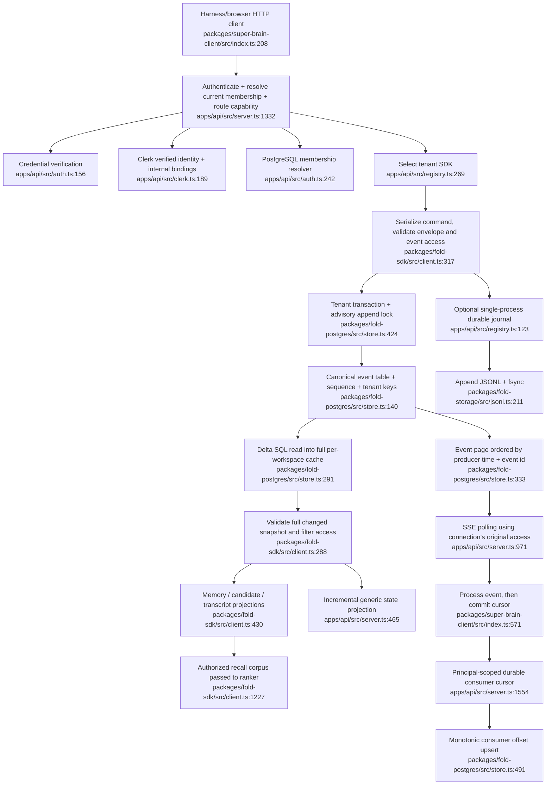

# Canonical platform and hosted operation — architectural audit

Date: 2026-09-04. Scope: canonical Fold contracts, SDK, JSONL/PostgreSQL stores, API identity/transport, HTTP client, operations scripts, and CI. This report is read-only apart from this audit artifact. Source references are repository-relative with inclusive line ranges. All Mermaid nodes identify a source file and line.

## Assessment

The architecture is a credible private-pilot foundation: immutable domain events, explicit provenance, separate rebuildable projections, authenticated and scoped APIs, transactional PostgreSQL batches, tenant-qualified storage, forced RLS, encrypted local capture upstream, and a real recovery/test toolchain. Preserve these boundaries. The next step should be a reliability and end-to-end product-value pass rather than a larger service decomposition.

A shared hosted deployment needs application correctness work in addition to infrastructure configuration. Bounded probes reproduced late-event cursor loss, stale SDK snapshots, duplicate command decisions across SDK instances, a local journal singleton race, and streaming access continuing after membership revocation. The documentation already acknowledges infrastructure work; these concurrency/revocation findings extend the stated production gate.

Parent verification result: `pnpm verify` exited 0, 443 passing tests across 74 files; 12 PostgreSQL integration tests skipped in the local environment. That is good regression coverage, but it does not establish correctness for multiple API processes or the deployed tenancy topology. PostgreSQL CI separately provisions a restricted role and pgvector (`.github/workflows/ci.yml:32-72`).

## Current flow



The core Fold ordering contract uses `(event.at.t, event.id)` and code-unit string comparison (`packages/fold/src/order.ts:19-36`). Import order may be backdated; validation only requires uniqueness and monotonic IDs among events sharing a timestamp (`:43-60`). PostgreSQL additionally has an insertion sequence, but that sequence currently serves cache revisions rather than consumer delivery.

## Findings with evidence

### 1. Separate delivery position from event time before trusting continuous processing

**Priority: ship blocker for reliable live processing, including a private pilot with delayed capture. Confidence: confirmed SDK behavior and direct storage/API logic.**

The event stream and durable cursor use `(t,eventId)` (`packages/fold-postgres/src/store.ts:333-370,491-513`; `apps/api/src/server.ts:1012-1022`). Both SDK and store accept events older than the newest event: producer validation only compares equal-time IDs (`packages/fold/src/order.ts:43-60`; `packages/fold-postgres/src/store.ts:388-400`). The PostgreSQL integration test intentionally inserts t=2 before t=1 (`packages/fold-postgres/test/store.test.ts:61-71`). A delayed event at t=90 that arrives after a consumer commits t=100 is permanently behind its exclusive cursor and will not be processed by that consumer.

A bounded Node probe appended a backdated event through the actual built FoldSdk: it was accepted and visible in the complete log, but the current `isAfterCursor` predicate returned no event after the newer cursor. This reproduces the contract defect without requiring a PostgreSQL service; PostgreSQL's SQL predicate is the same comparison.

**Add:** a durable tenant-scoped ingestion position for delivery, distinct occurred-at and received-at timestamps, stable producer identity, and an explicit late-arrival policy for projections. Maintain canonical historical replay by event time if desired. Test delayed spool replay, clock skew, disconnected clients, and restored consumers. A database sequence is already available; verify its ordering guarantees per tenant and use an opaque versioned delivery cursor. Keep the existing principal/tenant cursor namespacing.

### 2. SDK can permanently mark an incomplete snapshot as current

**Priority: blocker before multiple API writers. Confidence: reproduced with a shared revision-aware store; PostgreSQL applicability established by its revision implementation.**

`appendInternal` reads the log, appends its event, pushes that event into its local cache, then asks the store for the latest revision (`packages/fold-sdk/src/client.ts:331-344`). `appendSequenceInternal` does the same (`:364-376`). The latest revision is PostgreSQL `MAX(sequence)` (`packages/fold-postgres/src/store.ts:322-330`). If another process commits after the first snapshot read but before that final revision read, the SDK cache lacks the other event while claiming its revision. `readStoredEntries` skips incorporating returned entries when that revision matches (`packages/fold-sdk/src/client.ts:288-299`). It remains stale until a further revision changes.

Probe result with a second writer injected during append:

```text
persisted:       [own-event, other-process]
readAfterAppend: [own-event]
secondRead:      [own-event]
```

**Add:** return the committed revision/snapshot boundary from the append transaction and never attach a separately fetched global revision to a locally reconstructed snapshot. A safe short-term approach is invalidation plus fresh snapshot read; a durable approach is expected-revision commands with explicit committed results. Test with two API instances and forced interleavings.

### 3. Database append transactions do not make domain commands atomic

**Priority: blocker before multiple API writers. Confidence: reproduced across two actual FoldSdk instances sharing a store; PostgreSQL conclusion is source-based, not a live PostgreSQL run.**

The SDK's queue belongs to one in-process instance (`packages/fold-sdk/src/client.ts:258-274`). Candidate availability is checked before the append transaction (`:985-1006`). The PostgreSQL advisory lock wraps insertion, but does not recheck the expected candidate state or workspace revision (`packages/fold-postgres/src/store.ts:424-434`). Two instances can both observe a candidate as available, accept it under distinct event IDs, and create separate memories.

Probe result:

```text
concurrent acceptance results: [fulfilled, fulfilled]
active memories: 2
event kinds: candidate-proposed, candidate-accepted, memory.recorded,
             candidate-accepted, memory.recorded
```

**Add:** a command transaction/compare-and-swap contract covering validation and append, plus stable idempotency keys for retries. Audit memory revision, candidate rejection/promotion, trajectory tree revisions, and transcript catalog import under the same contract. Atomic multi-event insertion already exists in PostgreSQL and should remain the storage primitive.

### 4. Simultaneous first requests create multiple journal SDKs for one workspace

**Priority: blocker for the JSONL backend; not applicable to the currently observed PostgreSQL service. Confidence: reproduced with the actual JournalSdkRegistry and an isolated temporary directory.**

`JournalSdkRegistry.sdkFor` checks the map, then awaits `chmod`, then constructs/caches the SDK (`apps/api/src/registry.ts:187-201`). Concurrent first requests both pass the missing-entry check. They receive distinct SDKs with separate queues and permanently cached `stableReads` journals (`:123-139`). The process-wide directory writer lease prevents a second process, but not this same-process race.

Probe result:

```text
sameSdk: false
firstSdk after write: [first-sdk-write]
secondSdk: []
registry's selected SDK: []
```

**Add:** single-flight SDK creation per tenant, sharing an initialization promise before any await. Add a concurrent first-access regression test. Also choose the journal's multi-event crash contract: its store exposes only `append`, so SDK batch operations fall back to independent fsync appends (`packages/fold-sdk/src/client.ts:367-370`; `apps/api/src/registry.ts:137-139`), unlike transactional PostgreSQL. A crash halfway through acceptance/import can preserve only its prefix. Prefer PostgreSQL for the pilot if those semantics matter.

### 5. Revocation does not affect an already open event stream

**Priority: blocker for a hosted team deployment. Confidence: confirmed through an actual local HTTP SSE connection.**

The request authenticates and resolves membership once (`apps/api/src/server.ts:1332,1363-1370`). `startEventStream` retains that `access` object forever and only closes on transport failure/close (`:971-1037`). Every subsequent event batch authorizes against the original privileges (`apps/api/src/registry.ts:280-294`). There is no token lifetime, membership refresh, or authorization-version invalidation in this loop.

A bounded HTTP probe opened a stream, changed the membership resolver to deny access, appended a new event, and observed the new event on the existing stream: `receivedNewEvent: true`.

**Add:** revocation-aware stream lifetime and periodic/current authorization checks, ideally with authorization revision invalidation shared by all API processes. Test removal from organization, removal from space, and machine-token revocation while a stream is active. This is narrower than a claim that ordinary request authorization is broken: ordinary requests do resolve current memberships.

Related static concern: signed Clerk webhook processing is idempotent by event ID but carries no external event ordering/version (`apps/api/src/clerk.ts:272-317`; `packages/fold-postgres/src/tenancy.ts:460-580`). A distinct older upsert delivered after a deletion would apply again. Add stale-event rejection or reconciliation of current provider state before promising deprovisioning remains effective under delayed delivery. No live provider-delivery experiment was performed.

### 6. Read models remain proportional to complete history

**Priority: bound and measure before sustained multi-user capture; likely next architectural investment. Confidence: high static evidence, no load benchmark in this pass.**

PostgreSQL avoids rereading every row from SQL by fetching a sequence suffix, but retains every historical event, event-ID set, and tenant cache without eviction; it sorts and copies the entire event cache on each snapshot (`packages/fold-postgres/src/store.ts:19-23,105,291-315`). The SDK duplicates parsed entries and revalidates the entire changed history through all pack validators (`packages/fold-sdk/src/client.ts:260-264,288-314`), filters/sorts the complete log for authorized reads (`:388-400`), and rebuilds memory projections after relevant changes (`:430-441`). Candidate, transcript, and per-principal access caches multiply residency. Generic projection continuation helps replay cost, but still begins with a full authorized event list and scans its keys (`apps/api/src/server.ts:465-522`). Ordinary event pagination also starts with a full list (`:1583-1615`).

Projection checkpoint persistence exists (`packages/fold-postgres/src/store.ts:516-574`), but repository search found consumers only in its integration test, not API/SDK startup or read paths. JSONL checkpoints are integrity snapshots: verification rebuilds preceding history (`packages/fold-storage/src/checkpoint.ts:105-120`), and replay folds the full log (`packages/fold-storage/src/journal.ts:37-46`). They are not resumable production read models.

**Add:** bounded event-page queries for normal list endpoints, incremental domain projections, versioned/configuration-aware durable checkpoints, cache eviction, and a representative long-history benchmark reporting RSS, cold start, capture-to-recall lag, append latency, and p95 retrieval latency. Preserve event replay as the reference oracle. Avoid jumping to extra services until one process with bounded projections is measured.

### 7. Deployment controls exist as primitives; operate and drill the complete path

**Priority: hosted release gate; some parts also required for a dependable private pilot. Confidence: high source evidence; deployment evidence supplied separately by parent.**

- Tenant isolation is substantive: organization-qualified primary keys, transaction-local organization setting, forced RLS, and a non-bypass role guard (`packages/fold-postgres/src/store.ts:127-137,140-151,241-247,263-284`). The guard defaults off unless explicitly enabled (`apps/api/src/main.ts:118-127`); current local service was observed by the parent using PostgreSQL with Clerk off and the guard unset. That is evidence of a trusted local configuration, not a hosted security posture.
- `/health` always returns `status: ok` and does not test the database, worker lag, or writability (`apps/api/src/server.ts:1307-1310`). Add distinct liveness/readiness plus dependency/processing freshness metrics. A database failure after startup can leave liveness green.
- The rate limiter is process-local and keyed by remote socket plus bearer-string fingerprint (`apps/api/src/rate-limit.ts:18-24,37-48`; `apps/api/src/server.ts:616-624`). It is insufficient for shared quota/burst enforcement across hosts. SSE ignores write backpressure and has no connection cap (`apps/api/src/server.ts:1018-1032`). Add tenant/principal budgets and stream caps where exposure warrants them.
- The backup script creates a private SQL dump, checks archive readability, and hashes it (`scripts/backup-postgres.sh:7-19`). The restore script checks the checksum and restores to an explicitly disposable database (`scripts/verify-postgres-restore.sh:4-21`). It does not check application replay, memberships, RLS, consumer resumption, decryption keys, or artifact completeness. Schedule encrypted off-host backups and verify canonical replay plus a representative cited artifact restore under actual application credentials. Track restore age and recovery objectives. Local encrypted artifact/key storage upstream must be included in the restore plan; a SQL-only success is incomplete recovery.
- Startup executes schema DDL and configured identity replacements (`packages/fold-postgres/src/store.ts:121-249`; `apps/api/src/main.ts:251-262`). Define migration ownership and rolling-deploy compatibility; restart-loaded identity bindings replace provider-wide configuration (`packages/fold-postgres/src/tenancy.ts:390-405`). The docs correctly prefer signed provisioning over migration bindings for hosted operation (`docs/MULTI_TENANCY.md:104-113`).

## High-value mechanisms to add

1. **Delivery identity and freshness:** server ingestion position, occurred/received times, producer instance, import/run identity, deduplication key, and explicit processing watermark. Show captured → stored → processed → retrievable counts and lag in one operator view. This makes silent gaps visible and repairs the cursor boundary.
2. **Transactional commands and retries:** command IDs, expected revisions, atomic event batches, and deterministic retry responses. This is foundational for every downstream domain rather than another product surface.
3. **Versioned rebuildable read models:** recorded projector/configuration version, checkpoint position, extraction/model provenance, rebuild status, and corpus coverage. This makes projection upgrades reviewable and reduces memory growth.
4. **Continuously valid authorization:** authorization version on long-running access, revocation propagation, current provider reconciliation, and topology-level isolation probes.
5. **A recovery manifest:** canonical watermark, artifact references/checksums, key version, tenant coverage, consumer offsets, projection version, and last verified restore. The raw material largely exists; connect it into a drill that proves a user can retrieve cited evidence after recovery.

## Dependencies and limits

The API directly depends on the domain packs through FoldSdk, PostgreSQL through `pg`, optional pgvector/embedding HTTP provider, optional Clerk, and configured reasoning providers. The client requires authenticated HTTP and SSE. JSONL relies on a single process and filesystem durability; PostgreSQL is the intended shared store. CI tests the restricted PostgreSQL role separately from the normal suite.

No hosted environment, real database credentials, provider keys, raw transcript content, or production services were modified. Reproductions used actual compiled SDK/API code with temporary/fake stores and one isolated HTTP server; the local journal probe used a temporary directory and removed only its own artifacts. The PostgreSQL multi-writer implications are supported by the source but still need a live two-process integration test after remediation. This report does not claim a measured event-volume limit, successful off-host restore, or complete security certification.
