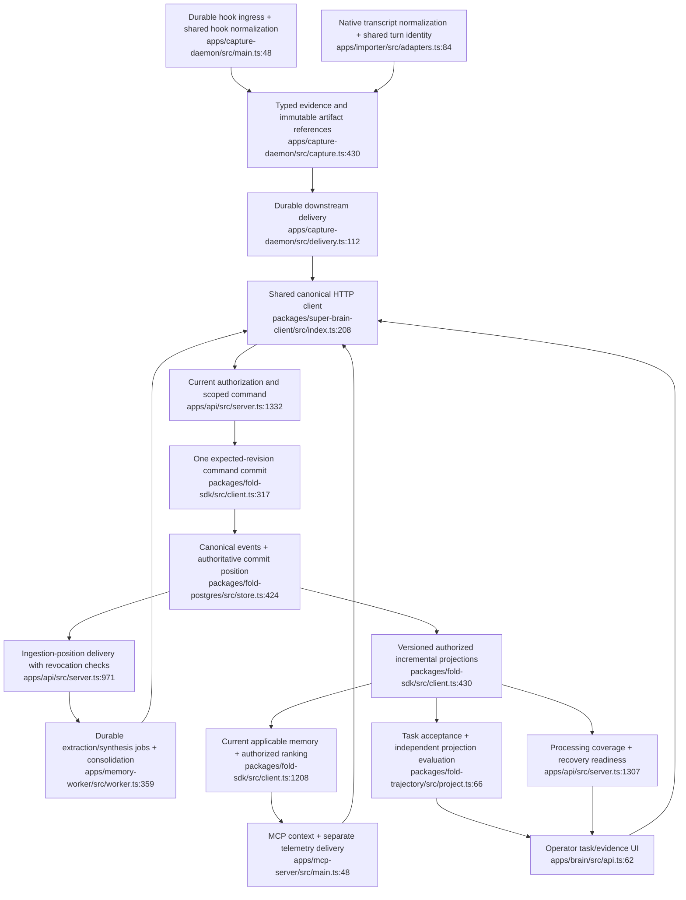

# Proposed architecture

This proposal preserves the existing event-sourced product. It consolidates the material concerns in [02-duplication-report.md](02-duplication-report.md) and adds only mechanisms needed for dependable evidence, shared operation and learning. Names below are proposed implementation targets; new modules do not exist yet.

## 1. One interpretation of each source format

**Hook entry point:** proposed `normalizeHookEvidence` in `apps/capture-daemon/src/evidence.ts`, followed by a pure typed evidence reducer. Replace live decoding in `capture.ts:71–135,742–845` and recovered decoding in `recovery.ts:17–57,149–217` with this path. Live I/O supplies observed Git/check/artifact facts; recovery supplies only what was actually retained. Task-key construction in `capture.ts:640–647,1140–1152` also delegates to a single function.

**Transcript entry point:** proposed `normalizeTranscriptRecord` and shared turn state in the existing importer adapter boundary (`apps/importer/src/adapters.ts:84,139`). Both `TranscriptBuilder` and `apps/memory-worker/src/vault.ts:42` consume those normalized records. Keep source-specific Claude/Codex parsing, but share identities and explicit result status. Metadata projection must never acquire transcript text merely to simplify the adapter.

**Capability change:** unsupported or missing check evidence becomes unknown; recovery stops reconstructing unsupported success. This intentionally reduces apparent verification/coverage in return for accurate evidence. Existing raw artifacts, provenance and source-qualified identities remain usable.

Durable ingress is a related reliability addition: persist an encrypted/redacted envelope with source event ID before slow interpretation, retain a sender retry path where acknowledgement is ambiguous, and report receipt/reconciliation state. This complements, rather than replaces, the downstream spool.

## 2. One command commit and one authoritative revision

**Entry point:** proposed internal `FoldSdk.commitEntries` replacing duplicated mechanics at `packages/fold-sdk/src/client.ts:317–377`. Public single/batch APIs retain their signatures and share candidate event builders (`:907–1078`). A store command transaction receives an expected revision and stable command ID, validates the expected state, appends the complete event batch, and returns the actual committed result/position.

The store owns durable event revisions. The SDK owns validated domain projections based on an exact store boundary. Remove the path that pushes one local event and independently reads the latest global revision. Invalidation plus a fresh read is a viable first fix; concurrent domain commands still require expected-state checks. The generic API projection remains a derived domain cache, not a third source of event truth.

**Delivery entry point:** retain `PostgresFoldDatabase.readEventPage` (`store.ts:333`) but use a versioned ingestion-position cursor for operational consumption. Preserve canonical `(t,eventId)` replay/fork semantics separately. Define a migration for old consumer cursors and deduplicate replays; do not silently reinterpret them. Late arrivals must reach consumers and invalidate/rebuild any affected historical projection.

**Capability change:** concurrent conflicting decisions become explicit conflicts or idempotent responses instead of duplicate successes. No valid single-writer behavior should be lost. JSONL must either implement its advertised command guarantees or be explicitly limited to a local fallback; fix registry initialization with a shared in-flight promise.

## 3. One scope-aware evidence consolidation policy

**Entry point:** proposed `consolidateCandidateEvidence` in `apps/memory-worker/src/worker.ts`, replacing independent irreversible duplicate suppression in `extractor.ts:156–166` and `worker.ts:107–192`. Identity includes the intended audience/space/project and claim/source policy. Preserve distinct evidence and contradictory content; do not treat title equality or copied context as independent confirmation.

Extraction, candidate contribution and accepted-memory revision must have separate authority semantics. A worker can contribute support for a human-owned shared memory without impersonating its creator. Personal memory remains creator-scoped. An authorized team correction appends an attributable revision/decision under an explicit shared policy.

**Processing entry point:** retain `processRun`/`watch` (`worker.ts:359–388`) as adapters into a durable per-artifact/turn/extractor-version job. Missing artifacts become waiting/retry states, with reconciliation and eventual explicit exclusion if unrecoverable. The event cursor means the work was durably received; processing success has its own watermark. Give synthesis a deterministic job identity based on evidence revisions, model/prompt version and purpose, so a failure or replay does not stop extraction or create unlimited duplicate proposals.

Choose synthesis inputs from current authorized active memories, not permanently accepted proposal views. Source changes and forgetting mark dependent synthesis stale/reviewable. Promotion checks the type and provenance of acceptance evidence, not only source labels or the trajectory's outcome string.

**Capability change:** fewer unreviewed promotions and fewer duplicate proposals are intentional. Distinct evidence is retained; global applicability must be explicit rather than inferred from unknown project identity.

## 4. One canonical API client contract

**Entry point:** extend `SuperBrainClient` (`packages/super-brain-client/src/index.ts:208`) with the shared canonical operations, pagination, cancellation/deadlines and structured error/retry-hint representation. `apps/brain/src/api.ts:62` becomes a UI adapter using it; importer delivery delegates its canonical transport while preserving import-specific response validation and bounded attempts. UI-only connection storage, Clerk token refresh and loopback operator artifacts remain outside the shared core.

Recall telemetry records one request identity and exact memory revisions with offered/injected/used/judged distinctions. It uses a narrow capability and durable/batched delivery, and cannot turn a successful read into a failed user operation. Import, spool and subscriber each retain their own delivery state machine while using one transport error classification.

**Capability change:** browser cancellation, retry hints and private operator access must be preserved. Read-only credentials regain successful read-only use. The loopback operator token must never be sent to the hosted API.

## 5. Operate and prove the existing spine

Use the existing durable checkpoint primitives for bounded, versioned incremental read models when the pilot benchmark justifies them (`packages/fold-postgres/src/store.ts:516–574`). This is an extension of projections, not an extra database or service. Add revocation-aware streams at `apps/api/src/server.ts:971`, dependency readiness beside `:1307`, tenant/principal quotas, and a recovery manifest covering PostgreSQL plus referenced artifacts and key versions.

Add a task/attempt manifest and independently verified acceptance evidence at the trajectory boundary (`apps/capture-daemon/src/capture.ts:1340`). The task evidence UI and benchmark exporter consume those records. A private backup export remains private; a shareable selected dataset needs its own manifest, permissions and reviewed redaction.

## Combined target flow

Nodes show existing integration locations. Names describe the proposed behavior at those locations; the new pure normalizer modules are described above rather than assigned fictional line numbers.

Implementation planning prompts are in [04-handoff-prompts.md](04-handoff-prompts.md). Detailed priority and product choices are in [05-assessment.md](05-assessment.md).
